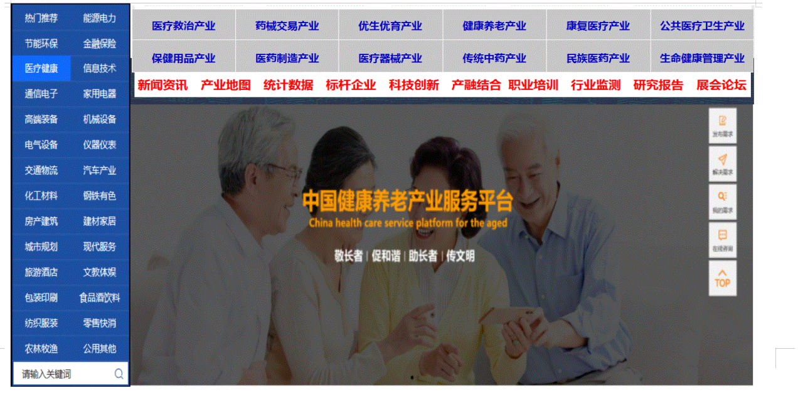

## 热门行业展示

### 热门行业子类

| 热门行业 | 负责人  | 行业分类                                                     |
| -------- | ------- | ------------------------------------------------------------ |
| ######## | ####### | ######                                                       |
| 文化产业 | 李阿兵  | 图书出版业  新闻传媒产业  广播影视业  动漫产业  网络文化产业  表演艺术业  广告产业  休闲产业（体育赛事，休闲娱乐业，文化旅游业等）以及会展产业 |
| 信息技术 | 程厚富  | 信息处理和服务产业   信息处理设备行业   信息传递中介行业   信息安全技术产业 |
| 节能环保 | 郑宇飞  | 高效节能技术和装备产业  高效节能产品   节能服务产业  先进环保技术和装备   环保产品   环保服务产业  节能照明产业  资源循环利用产业  大气污染治理产业  生态环境产业（生态保护生态修复）  清洁生产产业  清洁能源产业 基础设施绿色升级产业  绿色服务产业 |
| 电气设备 | 陈志霖  | 锅炉及辅助设备制造业  汽轮机及辅机制造业  水轮机及辅机制造业  风能原动设备制造  发电机及发电机组制造业  电机  输配电设备  电线电缆 电池电源  电器设备产业 |
| 纺织服饰 | 吴健爱  | 纺织原料产业  服装鞋帽产业   皮革箱包产业  印染   珠宝首饰  户外用品  羽绒       服装业、家用纺织品、产业用纺织品    棉纺织、化纤、麻纺织、毛纺织、丝绸、纺织品针织产业、印染业 |
| 旅游酒店 | 邓俊    | 酒店配套设备产业；酒店服务员及管理人员培训；酒店管理软件系统；酒店营销策划  旅游出行 旅游住宿 旅游餐饮 旅游游览  旅游娱乐 |
| 钢铁有色 | 黄伟皓  | 采矿业 钢铁 有色金属 黑色金属  金属冶炼  金属加工及制品  冶金产业 复合材料  新材料产业 |
| 医疗健康 | 吴邦福  | 医疗救治产业  药械交易产业  优生优育产业  健康养老产业  康复医疗产业  公共医疗卫生产业  保健用品产业  医药制造产业 医疗器械产业 传统中药产业 民族医药产业 生命健康管理产业 |

## 子类别

| 分类类别#### | 子类别1        | 子类别2      | 子类别3      | 子类别4      | 子类别5        | 子类别6        | 子类别7      |
| ------------ | -------------- | ------------ | ------------ | ------------ | -------------- | -------------- | ------------ |
| **新闻资讯** | 中央精神       | 部委政策     | 时政新闻     | 产经动态     | 今日焦点       | 专家访谈       | 政策解读     |
| **产业图谱** | 产业细分       | 行业细分     | 产业园区     | 前后产业链   | 产业区块链     | 产业生态圈     | 市场分布图   |
| **指数数据** | 产业发展指数   | 招商大数据   | 项目大数据   | 专利大数据   | 价格大数据     | 行业排行榜     | 关键数据发布 |
| **企业运营** | 名企排行榜     | 品牌排行榜   | 企业业务布局 | 上市企业分析 | 企业信用评价   | 企业营商环境   | 企业状态查询 |
| **产融结合** | 产业投融资信息 | 企业上市融资 | 项目融资租赁 | 产业基金信托 | 公私合作投融资 | 企业融资并购   | 总投资与结构 |
| **科创平台** | 科技创新规划   | 政府科创平台 | 园区服务体系 | 孵化项目信息 | 优秀研发团队   | 科技成果转化   | 创新战略联盟 |
| **产业监测** | 政府主管部门   | 民间行业协会 | 行业标准规范 | 行业数据监测 | 产业舆情监测   | 产业危机预警   | 产业风险防控 |
| **职教技培** | 委托招录培训   | 资格认证培训 | 技能岗位培训 | 产教融合模式 | 校企合作模式   | 行业技能大赛   | 产业培训联盟 |
| **研究报告** | 可行性报告     | 商业计划书   | 规划设计方案 | 专项调研报告 | 科技成果评价   | 产业技术咨询   | 产经评论分析 |
| **展会论坛** | 高端论坛       | 国际论坛     | 主题峰会     | 技术博览会   | 产品交易会     | 专业技术交流会 | 云端线上展览 |