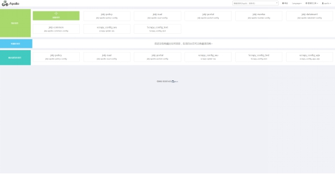
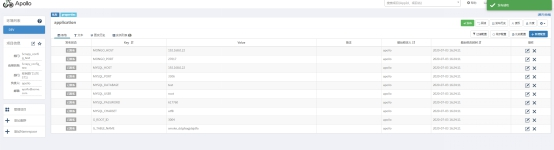

# Apollo 动态配置

### 介绍

[Apollo](https://github.com/ctripcorp/apollo)（阿波罗）来自于携程研发的**分布式配置中心**，能够集中化管理应用不同环境、不同集群的配置，配置修改后能够实时推送到应用端，并且具备规范的权限、流程治理等特性，适用于微服务配置管理场景。

### 1、安装

下载：[安装此安装包](../file/Scrapy-2.3.0.0.tar.gz)

安装：`pip install Scrapy-2.3.0.0.tar.gz`

这个包是scrapy的魔改版本，添加了对apollo的支持。Scrapy中所有的settings配置都可添加到apollo中。

### 2、Apollo使用步骤

进入apollo管理页面：

Apollo网址：http://192.168.3.85:8070/

登录账号：名字拼音

登录密码: 123456

 打开后Apollo管理页面：

 

点击新建项目

 

部门可以选择第一个就好，AppID是当前配置的唯一id，不要重复。应用名称 是当前的配置的名字，最好有标志性。项目负责人选择自己。

 

创建完成之后，进入主页面：

 

 

点击新增配置，把settings中的配置以键值对的形式存进去，然后保存。保存完毕点击那个绿色的发布按钮进行配置发布。

Apollo的配置文件创建就这样。

###  3、在scrapy中的应用

进入爬虫项目的settings.py文件， 添加如下：

```python
# apollo 配置中心
APP_ID = 'scrapy_config_common,Scrapy_config_quota, Scrapy_config_GUOYAN'
CLUSTER = 'default'
CONFIG_SERVER_URL = 'http://192.168.3.85:8096/'
```

这个APP_ID就是之前创建的apollo配置中的appid，  如果该爬虫项目需要使用多个apollo配置文件，那么就把配置的appid之间用逗号分隔开。

注意：建议每个爬虫三个appid，第一个appid当做数据(资讯或报告)公共的common配置，所有爬虫都添加一个common的配置，common配置中可以存放mongo或者mysql数据库地址等信息；第二个appid设置成行业的公用配置；第三个appid设置成当前爬虫私有的配置，可以存放当前爬虫的数据表名等信息。方便调试。爬虫的appid不一定要在apollo中存在，所以即使APP_ID选项写了某个appid，但是apollo中没有这个appid配置，也不会出什么问题。

```python
 APP_ID = 'scrapy_config_common,Scrapy_config_quota, Scrapy_config_GUOYAN'。
```

越在后的appid的配置优先级越高，如果这三个appid的配置中具有某个相同key。那么以最后一个为准。

例如：scrapy_config_common,Scrapy_config_quota, Scrapy_config_GUOYAN这三个apollo配置中都有一个MONGO_HOST的key，那么将会以最后一个appid，即Scrapy_config_GUOYAN中的配置为准。

代码中使用apollo的配置： 

```python
# py中获取Apollo配置
import pymogno
from pybase.apollo_setting import get_project_settings
class MongoPipeline():
    config = get_project_settings
    def __init__(self):
        self.client = pymongo.MongoClient(host=self.config.get('MONGO_HOST'),...)
```

或者使用

```python
from scrapy.utils.project import get_project_settings
config = get_project_settings()
config.get('MONGO_HOST')
```

获取配置就好

