# Jenkins

## 1、介绍
**jenkins是什么**
Jenkins是一个开源的、提供友好操作界面的持续集成(CI)工具，起源于Hudson（Hudson是商用的），主要用于持续、自动的构建/测试软件项目、监控外部任务的运行（这个比较抽象，暂且写上，不做解释）。Jenkins用Java语言编写，可在Tomcat等流行的servlet容器中运行，也可独立运行。通常与版本管理工具(SCM)、构建工具结合使用。常用的版本控制工具有SVN、GIT，构建工具有Maven、Ant、Gradle。

**使用目的：**

快速部署爬虫项目到scrapyd，并直接启动爬虫。

## 2、使用

 **1.打开jenkins**

地址：http://192.168.0.11:8088/，账号为姓名全拼，密码123456，主界面如下

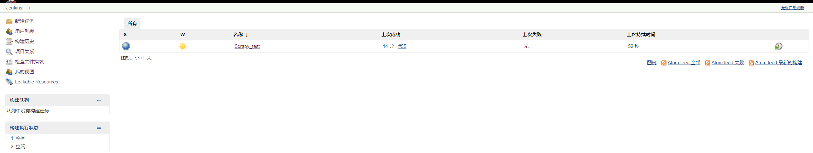

**2.新建任务**

点击左上方的“新建任务”，输入任务名称，任务名称需要使用“Scrapy_”开头。一个行业一个jenkins
项目，所以后面的名字最好可以标志该行业，例如：“Scrapy_C16_data”,代表C16行业的数据爬虫的
jenkins项目。然后选择“构建一个自由风格的软件项目”

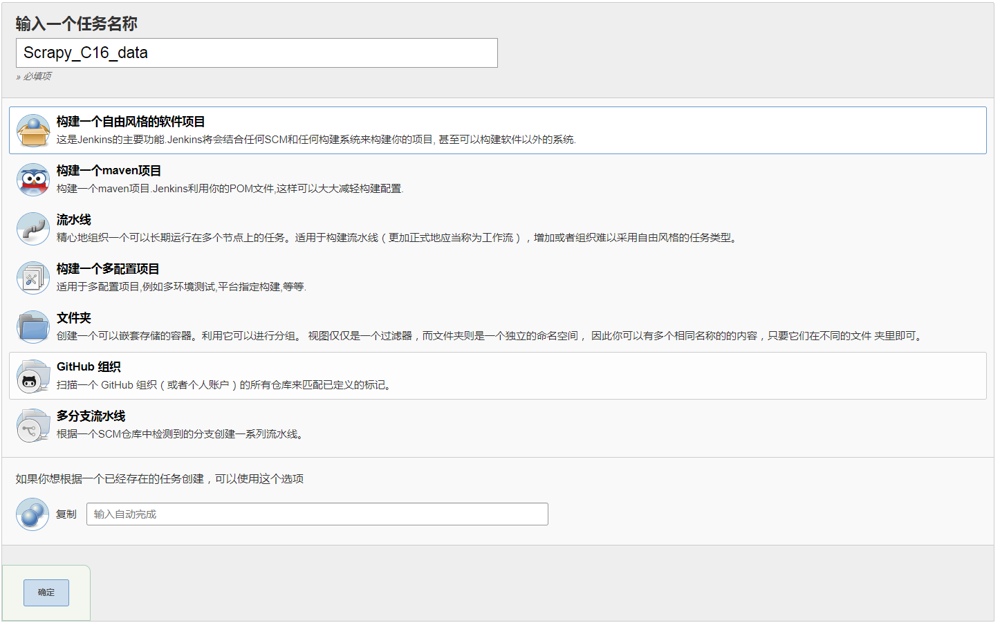

**3.项目设置**

在这里要对构建过程自定义。先设置通用功能

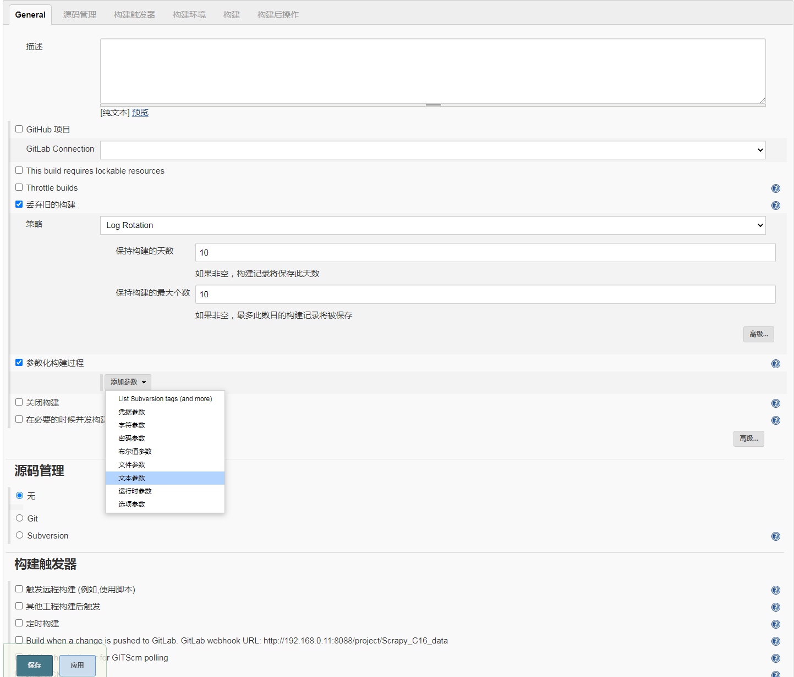

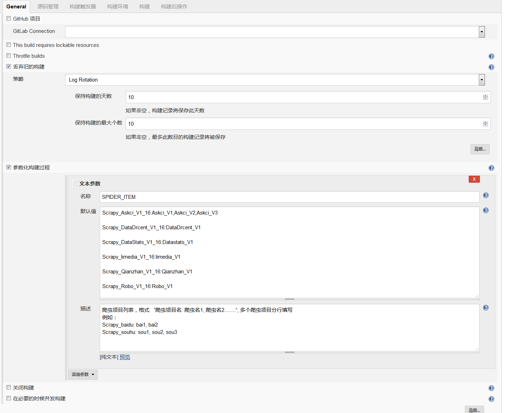

注意：**名称填"SPIDER_ITEM"**， 默认值中写行业工程中工程名以及工程中的爬虫名，格式： **"项目名称:爬虫名1,爬虫名2"**，多个项目需要分行写。描述选项是对这个参数的说明。

这样写jenkins在构建的时候会先上传“项目”，然后再启动项目中的“爬虫”，如果单单只想上传“项目
的话”， 把“项目名称”后面从冒号开始删掉就行了。例如直接写个“项目名称”，就只会上传这个项
目。

选项描述：“爬虫项目列表，格式   “爬虫项目名: 爬虫名1, 爬虫名2........”, 多个爬虫项目分行填写

例如：

Scrapy_baidu: bai1, bai2

Scrapy_souhu: sou1, sou2, sou3”

写以上这个描述就好。

接下来设置git地址：

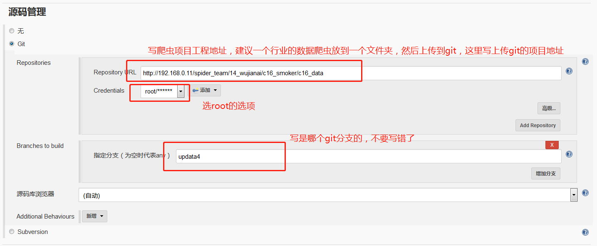

接下来设置构建后操作：


选择“Send build artifacts over SSH”选项：

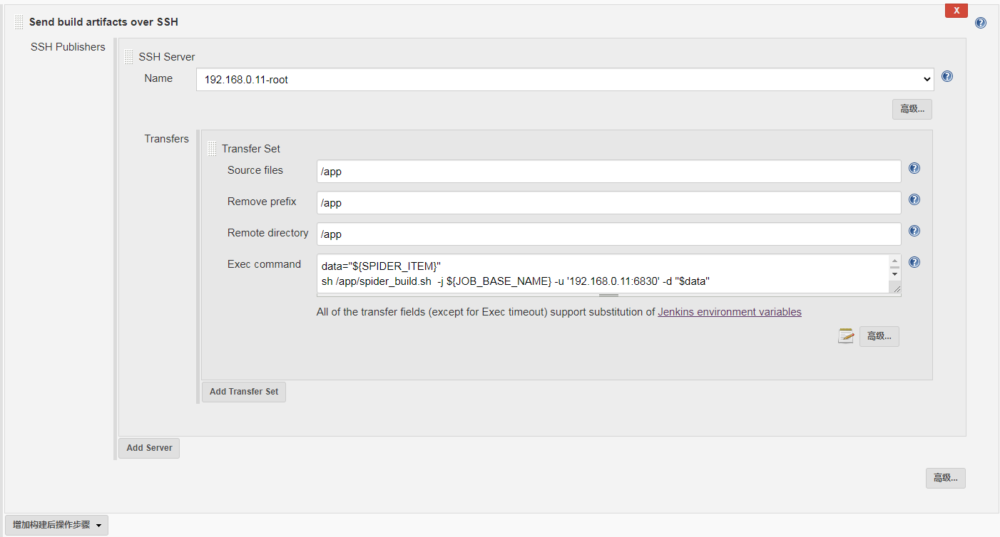

脚本：

```python
data="${SPIDER_ITEM}"
sh /app/spider_build.sh  -j ${JOB_BASE_NAME} -u '自己的scrapyd地址' -d "$data"
```

改下scrpyd的地址，直接粘贴进去就ok。

然后保存。回到首页，点击我们刚才新建的Scrapy_C16_data.

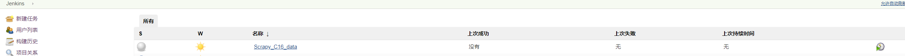

点击“build with param”

进入如下界面：

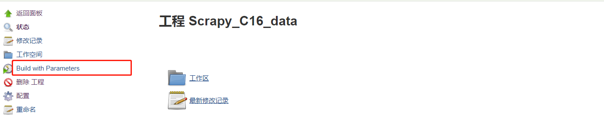

可以看到我们直接新建的变量。大家可以自己选择要构建哪个项目，启动哪个爬虫。自己进行删改就行。选好了，点击“开始构建”。

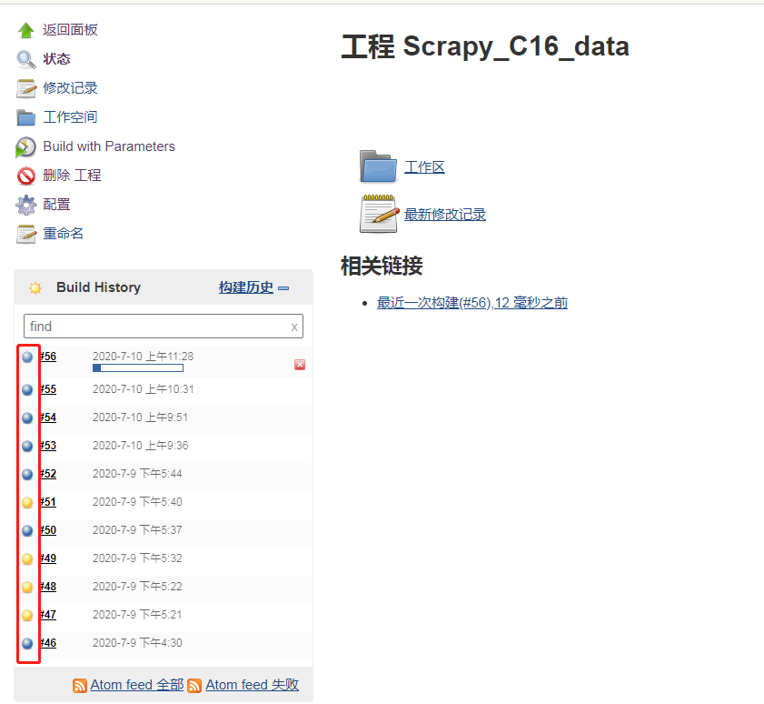

等待进度条走完，看下前面的图标是什么颜色。。。蓝色代表构建成功，其他颜色一律代表失败。如果失败那么点击那个  “#56”进去，可以查看日志。

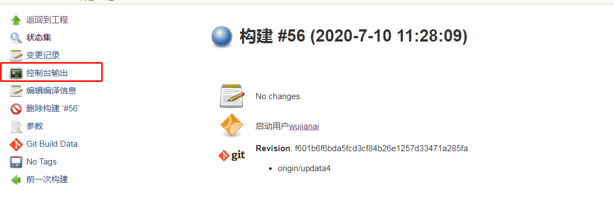

可以在里面看到构建信息。如果有错误，那么就进行错误排查。

Jenkins教程如上。不清楚可以再问。

### 可能出现的错误

一．

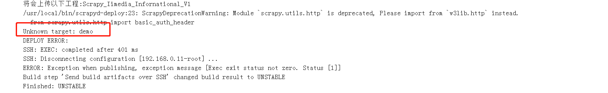

Unknown target: demo
因为设置的部署命令是scrapyd-deploy demo -p “爬虫工程名” 默认是demo，所以在scrapyd.cfg文件中的配置最好写成demo

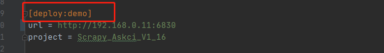

二．

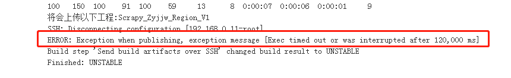

这种错误是由于shell脚本执行时间过长，导致jenkins超时，解决方法就是：

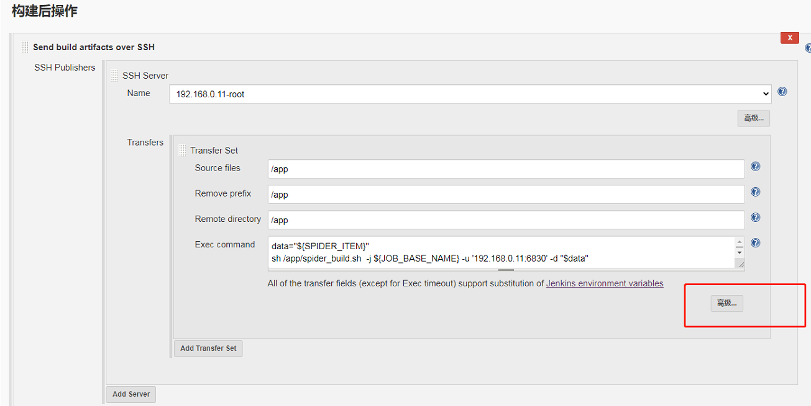

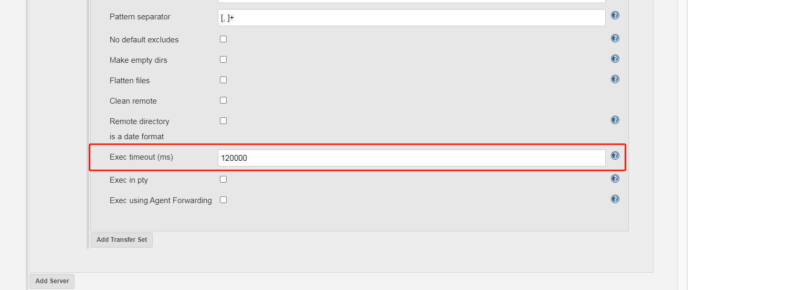

把Exec timeout选项参数设置大一点，默认2分钟超时，可以设置成240000ms（4分钟）超时。

三．

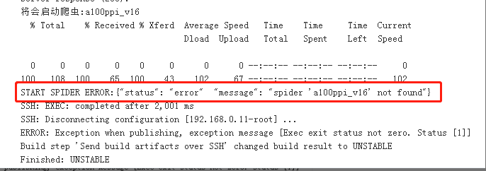

出现 spider ‘xxxx’ not found的错误，这是由于爬虫名字写错造成的。请严格注意大小写，空格等，务必与爬虫文件中的name属性保持一致。

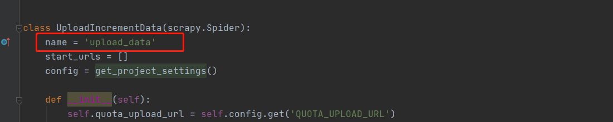